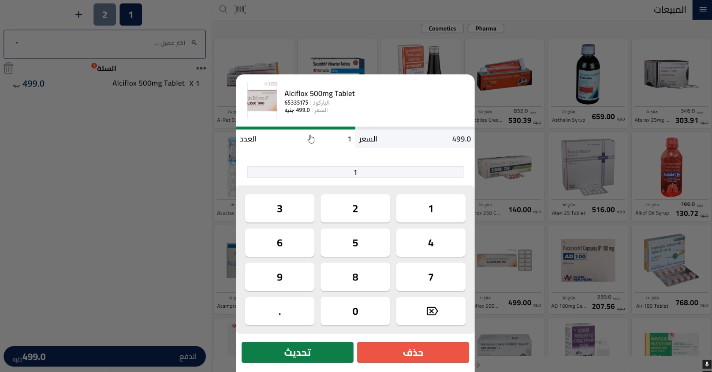

# 💊 iSupply – Pharmacy POS System



**iSupply** is a fully responsive, multi-platform Pharmacy Point-of-Sale (POS) app built using **Flutter** and **Supabase**, supporting Windows, Android, iOS, macOS, and Linux. It provides pharmacy staff with a localized and intuitive interface to manage inventory, suppliers, and invoices — all in one place.

---

## 🧰 Tech Stack

### 💻 Frontend
- **Flutter** (Windows, Android, iOS, macOS, Linux)
- **GetX** for navigation, controller logic, and localization
- **Hive** for local storage and offline caching
- **Responsive Framework** for adaptive layout
- **Custom Arabic/English font: Cairo**

### 🔙 Backend
- **Supabase** for:
  - PostgreSQL database
  - RESTful queries
  - Realtime updates (if used)

---

## 🚀 Features

- 🧾 Invoice generation and management
- 🔍 Smart filtering and searching
- 🖼️ SVG support for icons and illustrations
- 💻 Optimized desktop experience (Windows)
- 📱 Fully responsive layout — works on Android, iOS, macOS, Linux, and Windows
- 🌍 Multi-language interface: Arabic & English (with GetX)
- 🗃️ Local caching with Hive

---

## 📦 Installation

### ✅ Prerequisites

- [Flutter SDK](https://flutter.dev/docs/get-started/install) (≥ 3.7.0)
- A [Supabase project](https://supabase.com/)
- Any supported OS (Windows, Android, iOS, macOS, or Linux)

---

### 🔹 Setup

1. **Clone the repo**:

```bash
git clone https://github.com/KarimmYasser/isupply_app.git
cd isupply_app
```

2. **Install dependencies**:

```bash
flutter pub get
```

3. **Add Supabase config**:
Create a `.env` file in the root with:

```
SUPABASE_URL=your_supabase_url
SUPABASE_ANON_KEY=your_supabase_anon_key
```

4. **Run the app**:

```bash
flutter run
```

> You can run the project on any Flutter-supported platform: Android, iOS, macOS, Linux, or Windows.
> Make sure the appropriate platform support is enabled. Example:
>
> ```bash
> flutter config --enable-windows-desktop
> flutter config --enable-macos-desktop
> flutter config --enable-linux-desktop
> ```

---

## 🗃️ Supabase Tables (Suggested Schema)

| Table              | Description                      |
|-------------------|----------------------------------|
| `products`         | Product name, price, quantity    |
| `invoices`         | Date, total, invoice number      |
| `invoice_products` | Items included in each invoice   |

---

## 📁 Project Structure

```
lib/
├── core/           # App-wide utilities, services, and themes
├── features/       # Modular structure containing app features
├── localization/   # Language and localization handling
├── routes/         # Route and navigation configuration
└── main.dart       # App entry point
```

## 🎯 Key Packages

| Package                  | Purpose                             |
|--------------------------|-------------------------------------|
| `get`                    | Routing, state, localization        |
| `hive` + `hive_flutter`  | Local storage                       |
| `supabase_flutter`       | Supabase integration                |
| `flutter_svg`            | SVG asset rendering                 |
| `responsive_framework`   | Responsive layout across screens    |
| `faker_dart`             | Dummy data generation (dev/test)    |
| `flutter_dotenv`         | Environment variable management     |

---

## 🧑‍💻 Developer

- **Karim Yasser** – Developer (Flutter & Supabase)

---

## 📬 Contact

Developed by **Karim Yasser**  
🔗 [GitHub](https://github.com/KarimmYasser)  
🔗 [LinkedIn](https://www.linkedin.com/in/karimmyasserr)
